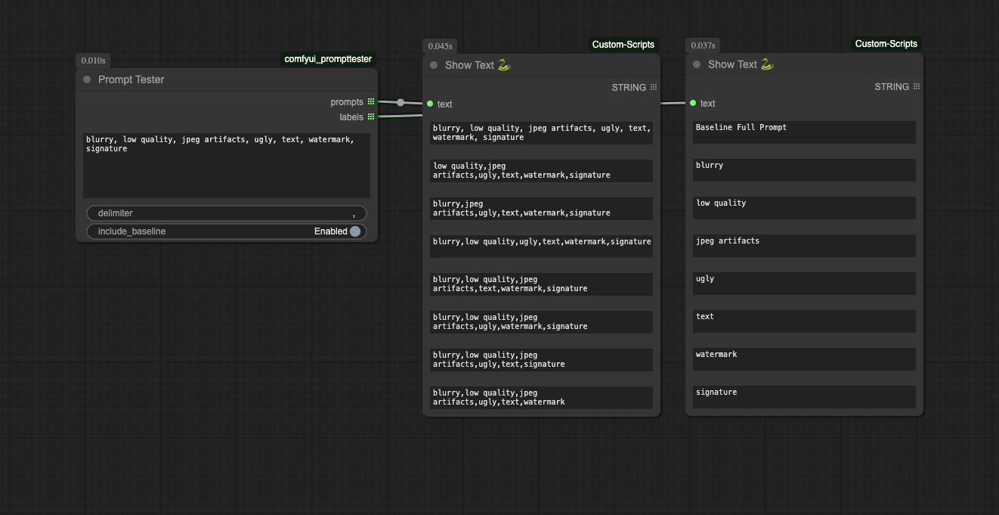

# Prompt Tester Node for ComfyUI

The **Prompt Tester** is a custom ComfyUI node that helps analyze the influence of individual phrases in a prompt. It splits a prompt into components and generates variations with each phrase removed, allowing easy comparison of their impact on generated outputs.

## Features

* Automatically splits prompts based on a customizable delimiter.
* Optionally includes a full-prompt baseline for comparison.
* Labels each prompt variation clearly for easy tracking.
* Output is structured for batch generation and side-by-side evaluation.

## Installation

1. **Locate your ComfyUI custom nodes folder**

2. **Clone or download this node** into its own subfolder inside the custom_nodes folder. For example:

   ```bash
   cd ComfyUI/custom_nodes
   git clone https://github.com/drphero/comfyui-prompttester.git
   ```

3. **Restart ComfyUI** to load the new node.

## Usage

* **Node Name in UI:** `Prompt Tester` (found under `utils/prompting`)

* **Inputs:**

  * `prompt` *(string, multiline)*: The full text prompt you want to test.
  * `delimiter` *(string)*: The character or word used to split the prompt into parts (default is comma `,`).
  * `include_baseline` *(boolean)*: Whether to include the original full prompt as the first item in the output list.

* **Outputs:**

  * `prompts` *(list of strings)*: Each string is a prompt variation with one phrase removed.
  * `labels` *(list of strings)*: Each label corresponds to the phrase omitted in that variation (or "Baseline Full Prompt").

### Example



**Input Prompt:**

```
blurry, low quality, jpeg artifacts, ugly, text, watermark, signature
```

**Delimiter:** `,`

**Output Prompts:**

1. `blurry, low quality, jpeg artifacts, ugly, text, watermark, signature` *(baseline)*
2. `low quality,jpeg artifacts,ugly,text,watermark,signature`
3. `blurry,jpeg artifacts,ugly,text,watermark,signature`
4. `blurry,low quality,ugly,text,watermark,signature`
5. `blurry,low quality,jpeg artifacts,text,watermark,signature`
6. `blurry,low quality,jpeg artifacts,ugly,watermark,signature`
7. `blurry,low quality,jpeg artifacts,ugly,text,signature`
8. `blurry,low quality,jpeg artifacts,ugly,text,watermark`

**Output Labels:**

1. `Baseline Full Prompt`
2. `blurry`
3. `low quality`
4. `jpeg artifacts`
5. `ugly`
6. `text`
7. `watermark`
8. `signature`

## Use Cases

* Prompt debugging and optimization.
* Finding which part of a prompt contributes most to visual output.
